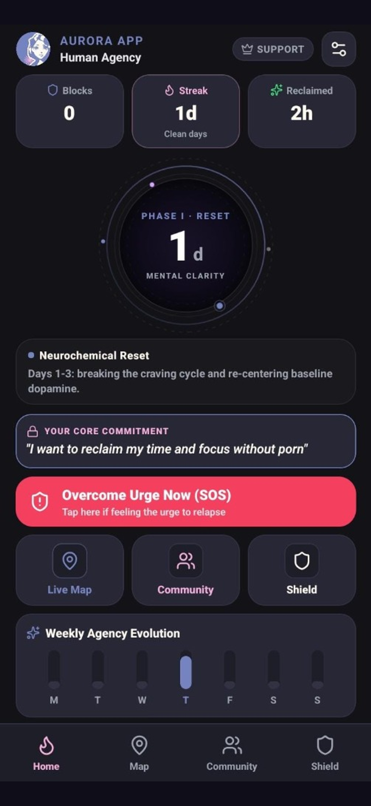
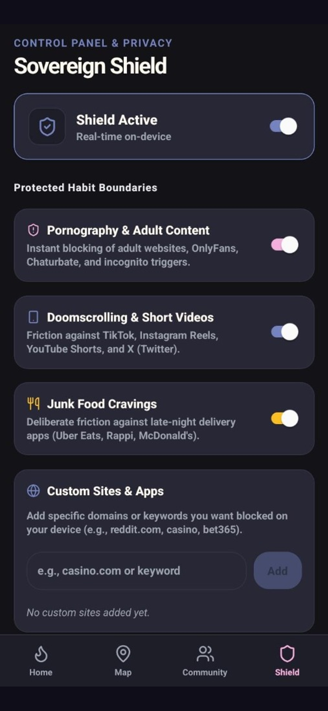
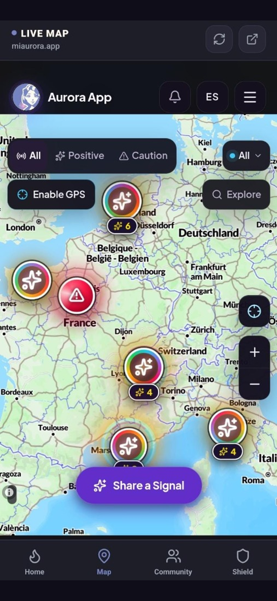
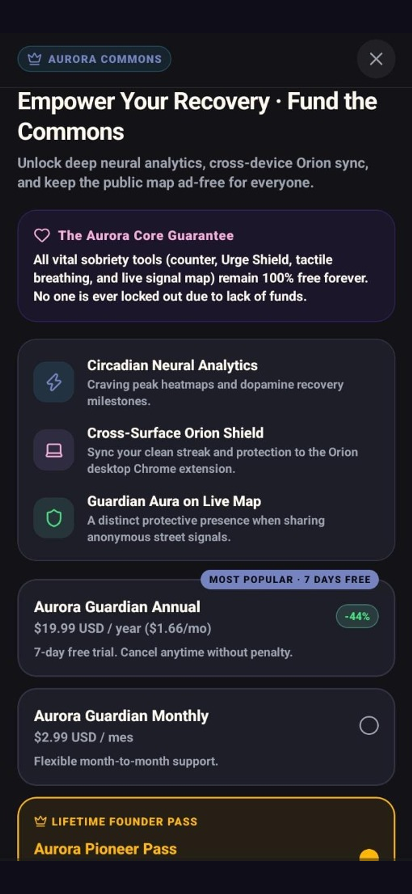

# Aurora App: Sovereign Clarity & Urban Safety 🌌
> **An open-source cross-platform (iOS, iPadOS & Android) mobile sanctuary restoring human attention and pedestrian trust.**  
> Official Submission for **RevenueCat Shipaton 2026** (Next Gen Award Track).

[](LICENSE)
[](https://apple.com)
[](https://android.com)
[](https://reactnative.dev)
[](https://expo.dev)
[](https://www.revenuecat.com)
[](https://onesignal.com)
[](https://www.typescriptlang.org)

---

## 👨‍🎓 Student Entrant & Hackathon Information

* **Author & Lead Developer**: **Alejandro Ortiz** ([@Alortiztique](https://github.com/Alortiztique))
* **Academic Affiliation**: **University of the People (UoPeople)** — B.S. in Computer Science
* **Role**: CTO at NeuronaX S.A.S.
* **Devpost Portfolio**: [Alejandro Ortiz (Alortiztique)](https://devpost.com/Alortiztique)
* **Competition**: RevenueCat Shipaton 2026
* **Primary Track**: 🏆 **Next Gen Award** *(Recognizing the best app submitted by active students with an open-source codebase and video demonstration)*
* **Cross-Track Eligibility**: 🕊️ **RevenueCat Peace Prize**, ✨ **RevenueCat Design Award**, 🔔 **OneSignal Keep Them Coming Back Award**, and 📣 **#BuildInPublic Award**.

---

## 📱 Quick Links for Judges & Evaluators

* 📥 **[Download Signed Production APK (v1.0.0)](https://github.com/Alortiztique/aurora-mobile/releases/download/v1.0.0/app-release.apk)** *(Directly installable on Android devices or emulators for instant zero-friction evaluation)*
* 🍏 **Cross-Platform Support (iOS, iPadOS & Android)**: Aurora App is built on a unified React Native 0.86 & Expo SDK 57 architecture with 100% design and feature parity. The exact same open-source codebase powers both Apple iOS/iPadOS (StoreKit 2 via RevenueCat, iOS system haptics) and Android / Samsung Galaxy.
* 🎥 **[Official Demo Video on Vimeo](https://vimeo.com/1231786894)** *(Walkthrough, live mobile demonstration & digital sovereignty manifesto)*
* 🌐 **Live Web Platform**: [https://miaurora.app](https://miaurora.app)
* 🐙 **Public Open-Source Repository**: [https://github.com/Alortiztique/aurora-mobile](https://github.com/Alortiztique/aurora-mobile)

[](https://vimeo.com/1231786894)

### 🔑 In-App Judge Access Code (Free Lifetime Unlock)
Judges can evaluate all Guardian and Pioneer capabilities without entering a credit card or billing credentials:
1. Open Aurora App on your Android device or emulator.
2. Tap the **"GUARDIAN"** badge in the top header (or navigate to **Settings** → **"Aurora Commons & Patronage"**).
3. Scroll down on the RevenueCat Paywall to the **"Hackathon Judge Code Access"** section.
4. Enter the official code:
   ```text
   SHIPATON2026
   ```
5. Tap **"Unlock Access"**. Lifetime Guardian & Pioneer status will immediately activate locally.

---

## 🌿 The Story Behind Aurora: Human Agency in the Machine Age

We live in an era where multi-billion-dollar algorithms wage an asymmetrical war against the human nervous system. Digital platforms deliberately exploit dopamine pathways, engineering compulsive urge loops, doomscrolling, and pornography addiction to maximize ad revenue. At the very same time, urban environments feel increasingly isolating, leaving individuals vulnerable and anxious when walking alone at night.

Most wellness apps worsen the problem: they mimic the very surveillance tricks of big tech—locking emergency rescue buttons behind aggressive paywalls at a user's most desperate moment, harvesting intimate emotional telemetry, or selling behavioral data.

**Aurora App was built as an artisanal sanctuary.** 

It proves that software can be quiet, deeply respectful, and biologically stabilizing. Most importantly, Aurora is powered by the **Patron Model**: **100% of our emergency mental health tools, habit recovery tracking, and urban safety maps are free forever for every human being**. Financially capable voluntary patrons fund the cloud commons for those who cannot afford to pay.

---

## ✨ Architectural Pillars & Standout Features

### 1. The Neural Clarity Sphere
Instead of infantilizing gamification with cartoon confetti, the home screen features a hand-crafted geometric vector sphere with concentric orbital rings and a 3.5-second micro-breathing pulse. It dynamically visualizes 5 neurobiological recovery phases as prefrontal cortex attention stabilizes:
* **Phase 1: Reset** (Day 0–3)
* **Phase 2: Clarity** (Day 4–13)
* **Phase 3: Awakening** (Day 14–29)
* **Phase 4: Sovereign** (Day 30–89)
* **Phase 5: Vanguard** (Day 90+)

### 2. Somatosensory Urge Shield (SOS)
An emergency physical down-regulation intervention combining 4-4-4-4 Box Breathing (*Inhale 4s → Hold 4s → Exhale 4s → Hold Empty 4s*) with synchronized physical `expo-haptics` impacts at every phase transition. Users can close their eyes entirely and physically feel the cycle pacing their vagal nerve regulation, coupled with an active mindfulness commitment mission.

### 3. Collective Urban Signals Map (Mapbox)
An obsidian-styled Mapbox map displaying recent, ephemeral community signals (well-lit commercial corridors, active pedestrian presence, broken streetlamps).
* **Privacy-Quantized Geometry**: Coordinates are strictly quantized to a 50-meter grid on Cloudflare edge servers.
* **Zero Surveillance**: No user tracking, no public profiles, no social feeds.

### 4. Secure Time-Bound Walk Links
Allows pedestrians to generate ephemeral, unguessable cryptographic tokens and share their live route progress with trusted contacts. Links automatically expire upon safe arrival.

### 5. Ethical Patron Commons (Powered by RevenueCat)
Integrated with the latest `react-native-purchases` and `react-native-purchases-ui`:
* **Guardian Annual**: $19.99/year (with 7-Day Free Trial)
* **Guardian Monthly**: $2.99/month
* **Pioneer Founder Pass**: $39.99 (one-time lifetime benefactor)
* **Judge Code Bypass**: `SHIPATON2026` / `AURORA-JUDGE`

### 6. Universal Multiplatform Parity (iOS, iPadOS & Android)
* **Native iOS & Apple Ecosystem**: Designed in strict alignment with Apple Human Interface Guidelines and dynamic typography. Full native support for Apple StoreKit 2 via RevenueCat (`react-native-purchases`), iOS system haptics (`UIImpactFeedbackGenerator`), safe-area insets, and iPadOS responsive layouts.
* **Samsung Galaxy & Foldable Optimization**: Constrained 680px ergonomic containers prevent control dispersion on the unfolded inner display of Samsung Galaxy Z Fold and Galaxy Tab tablets. Full support for Samsung Multi-Window & Pop-Up View alongside navigation or browser apps.
* **100% Shared Core Logic**: Domain models, recovery milestone state machines, Box Breathing haptic pacing, and privacy-quantized map projections are 100% shared across all mobile surfaces.

---

## 📸 App Interface Showcase

| 1. Neural Clarity & Recovery | 2. Somatosensory Urge Shield | 3. Collective Urban Map | 4. RevenueCat Patron Paywall |
| :---: | :---: | :---: | :---: |
|  |  |  |  |

---

## 🛠️ Codebase Structure

```text
aurora-mobile/
├── apps/
│   └── mobile/                # Expo 57 / React Native 0.86 application
│       ├── app/               # Expo Router file-based screens
│       │   ├── index.tsx      # Main tab navigator
│       │   ├── onboarding.tsx # Intentional onboarding & route selection
│       │   ├── paywall.tsx    # RevenueCat Patron Paywall + Judge Bypass
│       │   ├── walk.tsx       # Live encrypted walk session
│       │   └── signal.tsx     # Ephemeral community signal reporting
│       ├── src/
│       │   ├── components/    # NeuralClaritySphere, ShieldTab, MapTab, etc.
│       │   └── integrations.ts# RevenueCat and OneSignal configuration
│       └── android/           # Native Android project with AuroraShield accessibility
├── packages/
│   ├── domain/                # Pure domain logic (recovery phases, schemas, i18n)
│   └── design/                # Obsidian dark palette & typography tokens
├── store-assets/              # High-res 1179x2556 screenshots, icon & feature graphic
├── LICENSE                    # MIT Open Source License
└── package.json               # Root monorepo workspace configuration
```

---

## 🚀 Running Locally

### Prerequisites
* [Node.js](https://nodejs.org/) (>= 22) or [Bun](https://bun.sh/) (>= 1.2)
* Android Studio / Android SDK (for native emulator or USB debugging)
* Expo Go or Development Build

### Installation

1. Clone the repository:
   ```bash
   git clone https://github.com/Alortiztique/aurora-mobile.git
   cd aurora-mobile
   ```

2. Install dependencies:
   ```bash
   bun install
   # or: npm install
   ```

3. Configure Environment Variables:
   Create `apps/mobile/.env` with your public keys:
   ```env
   EXPO_PUBLIC_REVENUECAT_ANDROID_API_KEY=goog_xxxx_your_key_here
   EXPO_PUBLIC_REVENUECAT_IOS_API_KEY=appl_xxxx_your_key_here
   EXPO_PUBLIC_ONESIGNAL_APP_ID=your_onesignal_app_id_here
   EXPO_PUBLIC_MAPBOX_ACCESS_TOKEN=pk.your_mapbox_token_here
   EXPO_PUBLIC_API_URL=https://api.miaurora.app
   ```

4. Start the Development Server:
   ```bash
   bun start
   # or: bun --cwd apps/mobile start
   ```

5. Launch on Target Platform:
   ```bash
   # Run on Android Device / Emulator:
   bun --cwd apps/mobile android

   # Run on iOS Simulator (macOS):
   bun --cwd apps/mobile ios
   ```

---

## 📄 License

This software is released under the **[MIT License](LICENSE)**.  
Created with dedication by **Alejandro Ortiz** ([@Alortiztique](https://github.com/Alortiztique)), Computer Science Student at **University of the People**, for **RevenueCat Shipaton 2026**.
